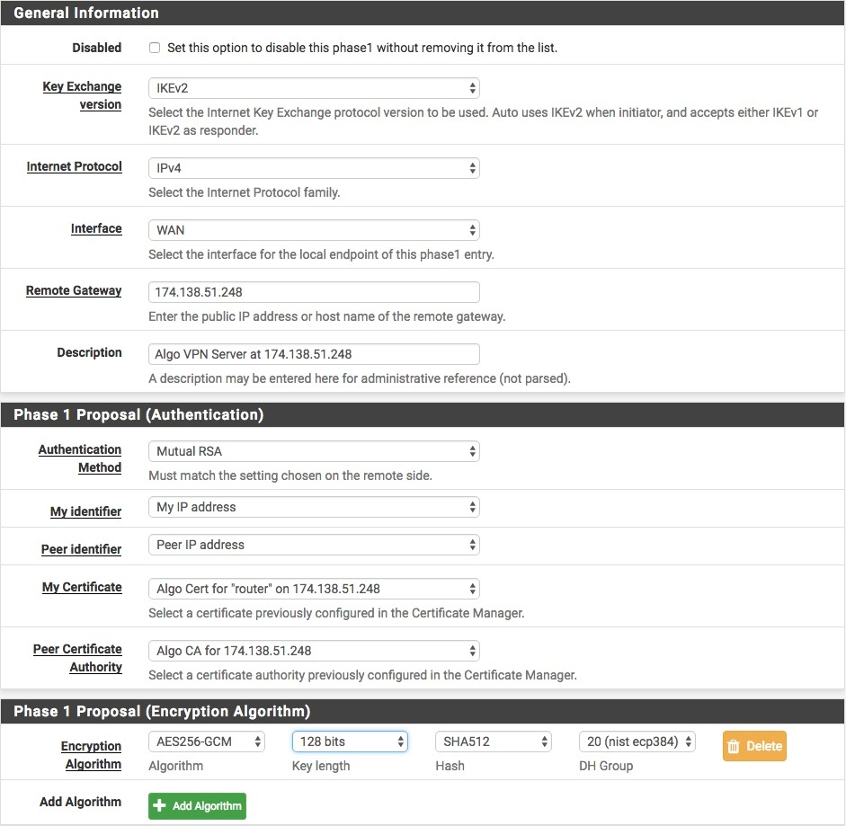
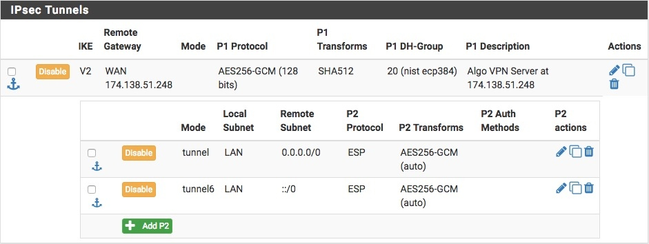

## Using an AlgoVPN with pfSense using IPsec

Corresponding GitHub thread [here](https://github.com/trailofbits/algo/issues/292).

This approach to connecting a pfSense router to an
[AlgoVPN](https://github.com/trailofbits/algo) shares the server between
the router and normal AlgoVPN clients. The Algo-side changes should work with
other routers as well.

Last updated: 2020-11-08: Revised instructions for reverting a change to the Algo CA certificates.

### Caveats

* This approach tunnels some or all of the LAN subnet to the AlgoVPN. NAT
occurs on the AlgoVPN side for both IPv4 and IPv6.

* This has been tested using pfSense 2.4.5-p1 in VirtualBox with an AlgoVPN
server on Vultr.

* This approach does not make use of the VTI (routed IPsec) feature added in
pfSense 2.4.4. As I understand it, supporting IPv6 using VTI requires IPsec on
the AlgoVPN to be accessible over IPv6, but AlgoVPN servers are only accessible
over IPv4.

* There are issues with IPsec and IPv6 in pfSense before 2.4.3.

* No additional pfSense firewall rules are necessary unless you want to
allow traffic that originates from the VPN side.

* MSS clamping appears to be necessary to make traffic flow smoothly and is
implemented by default. The values can be changed in the `router-updown.sh`
script.

* With this configuration in place pfSense will still send DNS requests over the
WAN. If you want DNS to go over IPsec, in DNS Resolver settings choose **LAN**
under **Outgoing Network Interfaces**. You must also have a Phase 2 that matches
the pfSense LAN interface address. DNS might fail if the IPsec tunnel becomes
unavailable, however. As an alternative you can use DNS over TLS with the
pfSense DNS Resolver.

* pfSense does not officially support the ECDSA certs created by Algo, but
they do work when you choose **Mutual RSA** when creating the Phase 1. You may
not be able to install ECDSA certs on pfSense versions older than 2.4.

### Instructions

* Revert a change to Algo:
   * A change to Algo (PR [#1675](https://github.com/trailofbits/algo/pull/1675)) has made the generated CA certificates incompatible with pfSense. To revert this change, fetch your copy of Algo with `git clone` and run these commands (ignore the error `Merge conflict in config.cfg`):

        ```
        git revert -n 0efa4eaf9175f4345fb8d81eb1d3c6205a57048e
        git restore --staged config.cfg
        git checkout -- config.cfg
        ```

* Edit the Algo `config.cfg`:
   * Add a user named `router` in addition to any other users you create.
     This approach assumes the router connection comes only from the user named
     `router` and that all other users are normal AlgoVPN clients.

* Run `./algo` per the instructions to create a new AlgoVPN server.
   * Or add the `router` user to an existing AlgoVPN server
     (see [Adding or Removing Users](https://github.com/trailofbits/algo#adding-or-removing-users)).
   * Once `./algo` has finished running, record the p12 password that gets printed to the screen.

* Install `router-updown.sh` on the AlgoVPN server:
   * Get a copy of `router-updown.sh` from this repository.
   * Follow the instructions in the script itself to install it, or use
     the `setup-router.sh` script in this repository to perform the installation
     steps for you.

* Import the certificates created by `./algo` using the pfSense **Certificate Manager**:
   * The certificates are in the directory `configs/<ip_addr>/ipsec/manual`
   * Import the CA, which is in the file `cacert.pem`
   * Decode the file `router.p12` to create the file `router.pem` which will contain the certificate and key for the user `router`. When prompted for a password, enter the p12 password previously recorded:
      * `openssl pkcs12 -in router.p12 -nodes -out router.pem`
   * Import the user certificate and key found in `router.pem`

* Add a Phase 1:
   * Any settings not shown are left at their defaults.
   * With recent versions of Algo you might not be able to connect a Phase 1 without also adding a Phase 2.





* Add a Phase 2 for IPv4 to the Phase 1:
   * This example routes the entire LAN subnet, but route whatever you wish by choosing another value for **Local Network**.
   * Multiple Phase 2 entries are supported. You can route multiple individual hosts this way.
   * Optionally, add a Phase 2 for IPv6 where **Mode** is **Tunnel IPv6** and the **Remote Network** address is `::/0`.


* Your IPsec configuration will look something like this:


